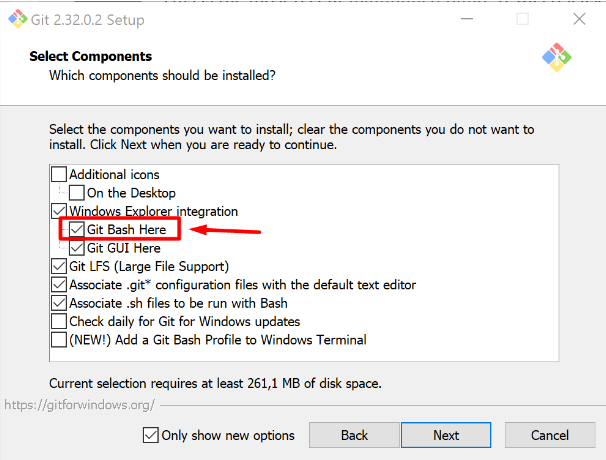

# Sobre o projeto

O projeto foi feito com o propósito de adotar uma estrutura de desenvolvimento profissional, especificamente seguindo o padrão atomic design. Todo o código foi desenvolvido empregando o TypeScript, proporcionando maior segurança e tipagem estática ao aplicativo. Para a gestão de navegação entre as diferentes páginas, recorreu-se ao pacote react-router-dom.

Na parte de formulário, a biblioteca Formik foi incorporada permitindo que os usuários façam pedidos. Além disso, para melhorar a usabilidade, foi integrado o pacote react-input-mask, que adiciona máscaras aos campos de input, aprimorando a experiência do usuário ao inserir informações.

Quanto à estilização, a abordagem adotada foi a utilização do styled-components, uma biblioteca que permite criar estilos de forma mais modular e coesa, melhorando a manutenção e escalabilidade do CSS ao longo da aplicação.

Para as comunicações com o servidor, foi empregada uma API que possibilita a realização de requisições HTTP GET e POST. Especificamente, na finalização do pedido, a API gera um "order id" para rastreamento e registro.

A gestão do estado da aplicação foi tratada através do Redux, uma biblioteca que facilita o gerenciamento global de estados, no caso, o estado do carrinho de compras da loja. Isso permite que diferentes componentes tenham acesso e sincronizem informações sem a necessidade de passar props de um componente para outro.

No geral, o projeto demonstra uma abordagem completa e bem estruturada, incorporando tecnologias e padrões de desenvolvimento atuais para proporcionar uma experiência de usuário fluida e uma base sólida para futuras expansões e manutenções.

## Acesse

<a href="https://ecommerce-restaurante.vercel.app/">Acesse a aplicação clicando aqui</a>.

## Video do projeto

<a href="https://studio.youtube.com/video/9eQrSydi5WA/edit">Video do projeto aqui</a>.

## Linguagens utilizadas

Typescript | React | HTML | styled-components

 
  
  
  
  

## Como instalar

Para preparar o ambiente, precisaremos ter algumas coisas instaladas no computador, sendo elas:

Node.js
<a href="https://nodejs.org/pt-br">Clique aqui para instalar o Node.js</a>.

Para instalar o Node, clique no link e baixe a versão LTS (versão recomendada)
Para verificar se foi instalado corretamente, abra o terminal e escreva node -v ou node --version
alt text: site do Nodejs, com o botão da versão recomendada em foco por um quadrado vermelho!

Git
<a href="https://git-scm.com/download/windows">Clique aqui para instalar o Git</a>.

Caso não tenha um terminal de preferência, recomendo utilizar o git bash. Para instalá-lo, haverá uma opção durante a instalação do git para permitir instalar o git bash
alt text: imagem mostrando várias caixas selecionáveis. A caixa “Git Bash Here” está em evidência por um quadrado vermelho com uma seta apontada para ele

Para verificar se o git foi instalado corretamente, abra o terminal e escreva git --version
Visual Studio Code

Entre no link e baixe a versão de Windows.

<a href="https://code.visualstudio.com/download">Clique aqui para instalar o Visual Studio</a>.

Clique com o botão direito em algum local do computador e selecione a opção Git Bash Here.

Escreva no terminal o comando abaixo e no lugar de 'cole aqui' entre no projeto do GitHub e cole o link do projeto.

git clone 'cole aqui o link do projeto'

Uma pasta com o projeto desejado será adicionada a pasta em que foi escolhida.
Clique com o botão direito em cima da pasta e selecione "Abrir com Code"

Uma vez que o Visual studio estiver aberto com o projeto desejado, abra o terminal clicando no menu da aba superior e digite no terminal aberto o código "npm install" e logo em seguida digite "npm start". Uma janela do browser será aberta e o projeto será iniciado em seu computador.

 

# :sunglasses: Autor 

 

Lucas Santana Figueiredo

 
  
  
  

